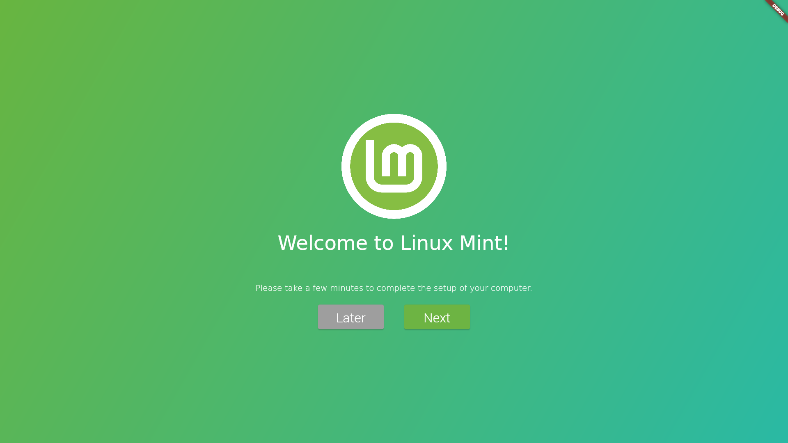
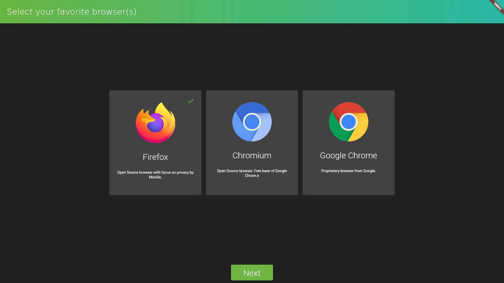
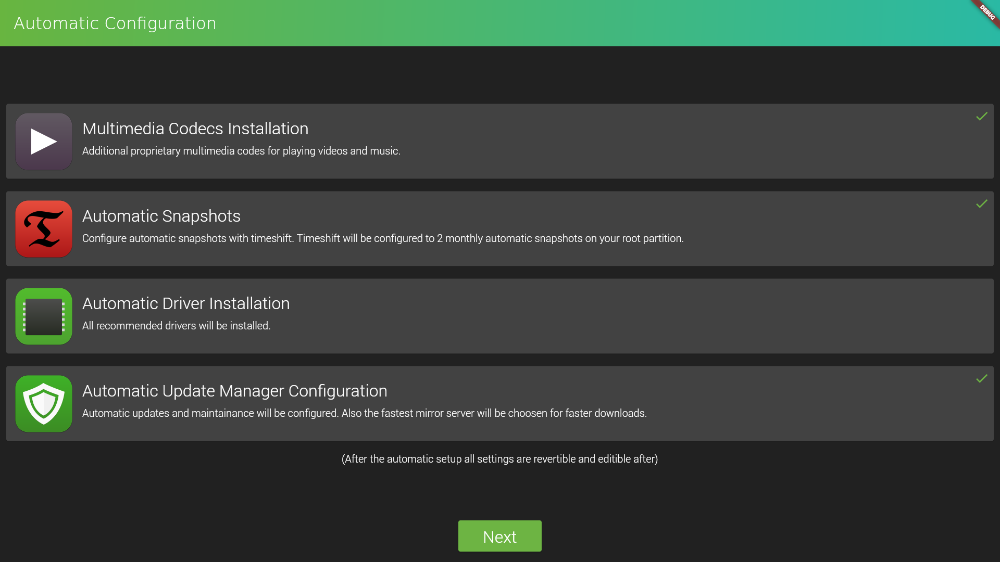
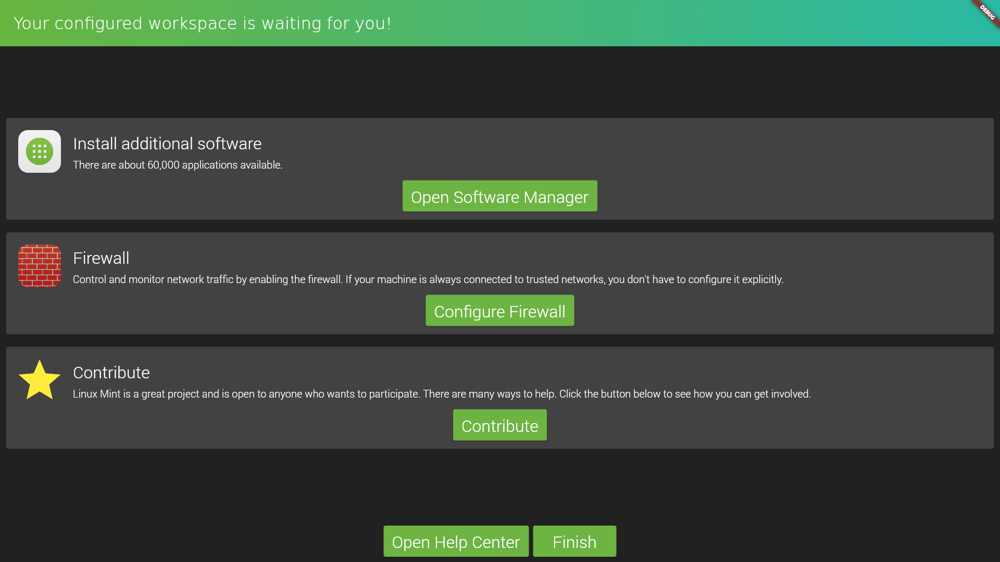

# Unoffical mint-welcome proposal
Unofficial welcome screen for linux mint. Proposal for the linux mint project.
Built with flutter.

This app isn't functional at the moment.
It is just a proposal and gives inspiration, how a future version mint welcome could look like
and which functionality it could have in the future.

## Feel free to try out [here](https://www.server-jean.de/mint-welcome-proposal/)



## Backend
Probable a backend for mint-welcome would be one or more python scripts.
How a very simple example of the technical implementation could look like,
you can watch the files `python/test_script.py` and `lib/runLinuxCommand.dart`.

## Theme Integration:
Flutter does not support any common linux desktop themes.
So everything has to be built by hand.

### Mint-Y
The file is located under `lib/mintY.dart`.
I built a collection with support for "pages", buttons, text, the mint colors and other widgets.

Currently dark/bright themes and the primary color is supported by my Mint-Y theme. \
*(Obviously I did a more modern interpretation about the theme ;) )*\
Sadly for a switch between the dark and the bright theme a application has to be restarted.

Icon themes are currently not supported by my module. Every icon needs to be loaded in as a specific image.
(Maybe a "icon call" package for linux could be built in the future.)

Some impressions about the Mint-Y theme:








## How to build on linux (mint)
- Have gtk3 installed on your linux. It's used by the linux implementation of flutter.
- Install flutter and configure it. I choosed the snap variant <https://docs.flutter.dev/get-started/install/linux>:
```
sudo mv /etc/apt/preferences.d/nosnap.pref ~/Documents/nosnap.backup # You only need this command at linux mint.
sudo apt update
sudo apt install snapd
sudo snap install flutter --classic
flutter config --enable-linux-desktop
```
- Run `flutter build linux` inside this directory.
- The executable can be found at `build/linux/x64/release/bundle/`.

## How to build for web (only for presentation)
- `flutter build web --base-href='/mint-welcome-proposal/'` (When you reach the webapp under `localhost/mint-welcome-proposal` for example.
